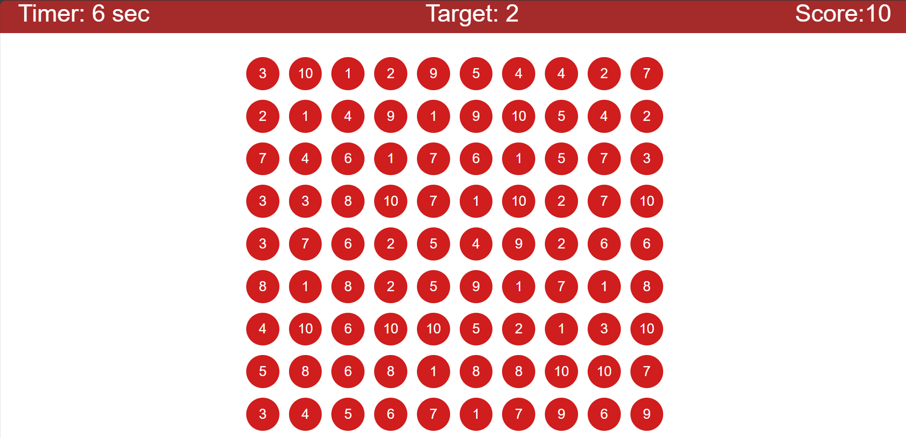

# 🎯 Number Matching Game

A fun and simple browser-based number matching game built with **HTML, CSS, and JavaScript**.

---
## 🔗 Live Demo

👉 [Play the Game](https://target-gam.netlify.app/)

---

## 🕹️ How to Play

- A **target number** between 1–10 appears at the top.
- A grid of **90 randomly numbered circles** is displayed.
- Click the circle that matches the target number.

### ✅ If you click correctly:
- +10 points to your score
- Timer resets to 10 seconds
- A new target number is generated

### ❌ If time runs out:
- The game ends
- A **Game Over** screen appears with your score and a **Play Again** button

---

## 📸 Screenshot

>


---

## 🧠 Event Delegation (Used in This Project)

This project uses **event delegation** to efficiently handle click events on 90+ circles.

Instead of adding event listeners to each circle individually:
```js
document.querySelector(".numberContainer").addEventListener("click", function (e) {
  if (e.target.classList.contains("circle") && e.target.innerText == targetValue.innerText) {
    // Handle correct click
  }
});
```

This approach:

Improves performance

Reduces memory usage

Makes dynamic DOM updates easier

📱 Responsive Design
The game layout adjusts beautifully for:

✅ Desktop

✅ Tablet

✅ Mobile devices

Implemented with CSS media queries to resize circles, text, and layout.

🛠 Technologies Used
HTML — Structure

CSS — Styling and responsiveness

JavaScript — Logic, scoring, timers, DOM manipulation

🚀 Getting Started
1. Clone the repository
   git clone https://github.com/ritik-kumar123/Target-Game.git
cd Target-Game

2. Open the game
Just open the index.html file in your web browser.

📁 File Structure
📦 Target-Game
┣ 📂 image
┃ ┗ 📄 screenShot.png
┣ 📄 index.html
┣ 📄 style.css
┣ 📄 script.js
┗ 📄 README.md


✨ Features
🧠 Random number generator

⏱️ Countdown timer

🧩 Event delegation for performance

🖥️ Responsive layout

🔁 "Play Again" button after game over

🙌 Author
Made with ❤️ by Your Name

📄 License
This project is open-source. Use it, learn from it, or modify it freely.

